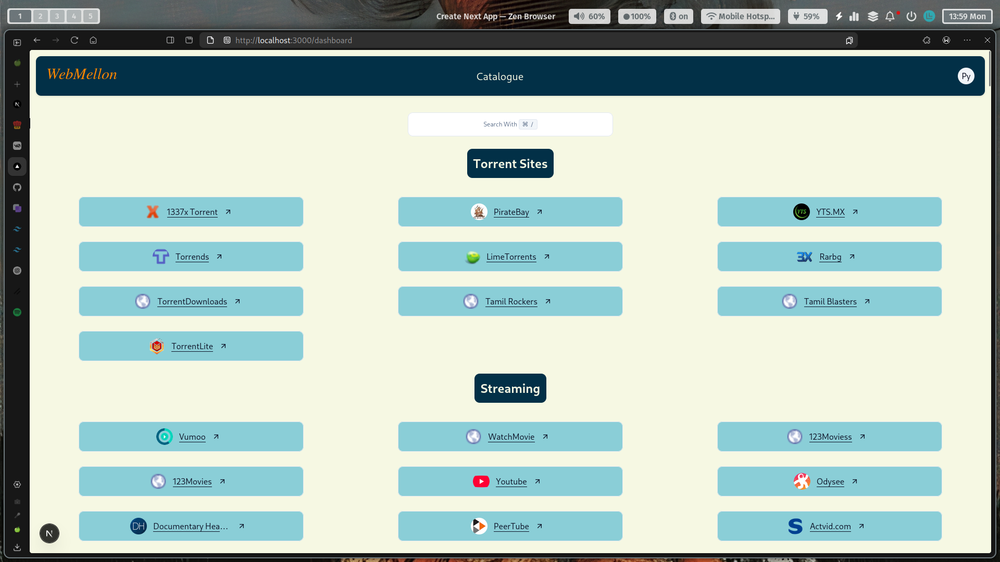

# 📚 WebMellon – Bookmark Aggregator App

WebMellon is a full-stack bookmark aggregator that lets users create, manage, and organize catalogues of websites. Built with the modern web stack – including Next.js, Prisma, and Tailwind – WebMellon is optimized for clarity, performance, and extensibility.

---

## 🛠️ Tech Stack

- **Frontend & Backend**: [Next.js](https://nextjs.org/)
- **Database ORM**: [Prisma](https://www.prisma.io/)
- **Authentication**: [NextAuth.js](https://next-auth.js.org/) (Google OAuth)
- **UI Styling**: [TailwindCSS](https://tailwindcss.com/)
- **State Management**: [Jotai](https://jotai.org/)
- **Component System**: [shadcn/ui](https://ui.shadcn.com/)
- **Session Handling**: JWT with secure cookies
- **Deployment**: [Vercel](https://vercel.com/)
- **Containerization**: Docker + Docker Compose
- **CI/CD Pipeline**: Github workflow and Vercel
- **Database**: PostgreSQL

---

## 🚀 Live Deployment

If you want to simply try the application, go to:

👉 [https://webmellon.vercel.app](https://webmellon.vercel.app)



---

## 🚀 Getting Started

### Prerequisites

- [Node.js](https://nodejs.org/) v23.9.0
- [Docker](https://www.docker.com/)
- [Docker Compose](https://docs.docker.com/compose/)

### 1. Clone the Repository

```bash
git clone https://github.com/suryanshu-09/webmellon.git
cd webmellon
```

### 2. Environment Variables

Create a `.env` file or populate the ENV file::

```env
DATABASE_URL=postgresql://postgres:postgres@db:5432/postgres
NEXTAUTH_SECRET=your_secret_here
NEXTAUTH_URL=http://localhost:3000

GOOGLE_CLIENT_ID=your_google_client_id
GOOGLE_CLIENT_SECRET=your_google_client_secret

GITHUB_ID=your_gihub_client_id
GITHUB_SECRET=your_gihub_client_secret
```

### 3. Run the docker image

```bash

docker run --env-file .env -p 3000:3000 suryanshu09/webmellon
```

This will:

- Spin up PostgreSQL database
- Build and launch the Next.js app
- Run migrations and seed if configured

---

## ✨ Features

- 🔐 Google-based authentication with secure JWT cookies
- 📁 Create, update, and delete catalogues and websites
- 🔎 View bookmarks in a responsive dashboard
- ⚡ Snappy UI powered by Tailwind and ShadCN components
- 🧠 State managed with Jotai for reactivity and ease

---

## 🧪 Development

To run locally without Docker:

```bash
# 1. Install dependencies
npm install

# 2. Set up PostgreSQL (e.g. with Docker or locally)

# 3. Set your local .env and run Prisma
npx prisma migrate dev
npx prisma db seed

# 4. Start dev server
npm run dev
```

---

## 🧩 Folder Structure

```
prisma/            # Prisma schema and seed
app/               # Next.js App Router
components/        # Reusable UI components
lib/               # Utility and API helpers
atoms/             # Jotai atoms for global state
```

## 🚨 Note  
Ensure your **cookies** and **middleware** configurations adapt based on `NODE_ENV`.  
Use secure settings in production and relaxed ones in development for smoother debugging.

## 🚀 Future Functionalities  
- Add RSS feed support

