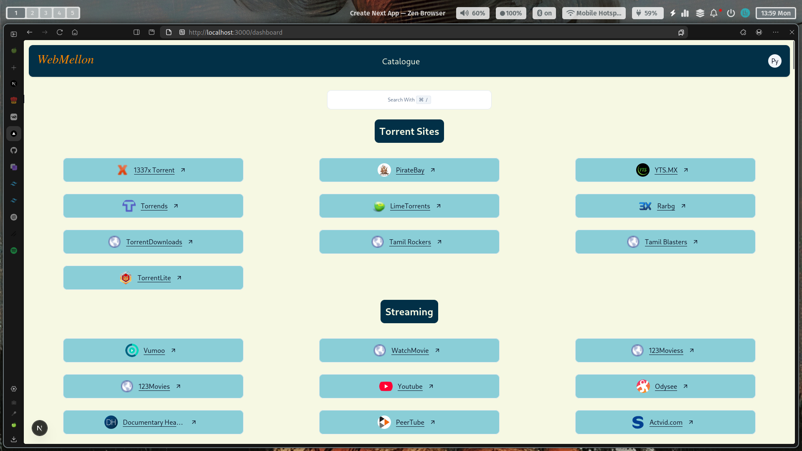
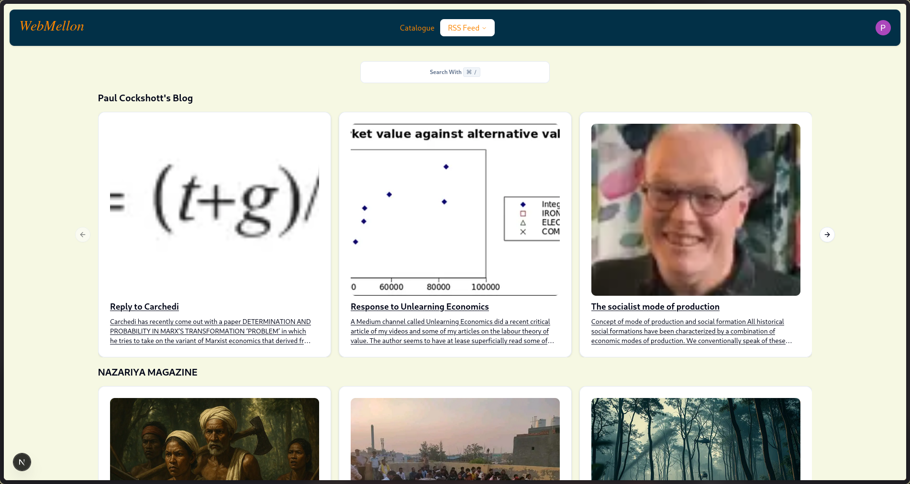
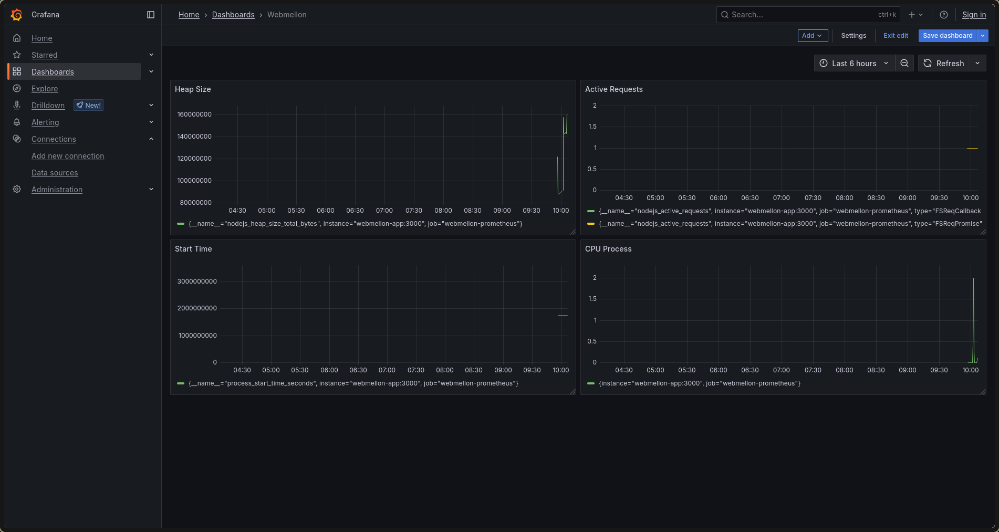

# 📚 WebMellon – Bookmark Aggregator App with customisable RSS Feed

WebMellon is a full-stack bookmark aggregator that lets users create, manage, and organize catalogues of websites. Built with the modern web stack – including Next.js, Prisma, and Tailwind – WebMellon is optimized for clarity, performance, and extensibility.

Now with **Feed** - an RSS reader for Youtube, WordPress and all your favourite News websites.

---

## 🛠️ Tech Stack

- **Frontend & Backend**: [Next.js](https://nextjs.org/)
- **Database ORM**: [Prisma](https://www.prisma.io/)
- **Authentication**: [NextAuth.js](https://next-auth.js.org/) (Google OAuth)
- **UI Styling**: [TailwindCSS](https://tailwindcss.com/)
- **State Management**: [Jotai](https://jotai.org/)
- **Component System**: [shadcn/ui](https://ui.shadcn.com/)
- **Session Handling**: JWT with secure cookies
- **Deployment**: [Vercel](https://vercel.com/)
- **Containerization**: Docker + Docker Compose
- **Metrics:** Prometheus for local monitoring metrics and Grafana for visualisation [Dev branch]
- **CI/CD Pipeline**: Github workflow and Vercel
- **Database**: PostgreSQL
- **RSS Parser**: rss-parser

---

## 🚀 Live Deployment

If you want to simply try the application, go to:

👉 [https://webmellon.vercel.app](https://webmellon.vercel.app)

Use **Guest Login** if you don't want to signup with your github or gmail account.

\*Note: Guests cannot access special routes like edit and profile.




---

## 🚀 Getting Started

### Prerequisites

- [Node.js](https://nodejs.org/) v23.9.0
- [Docker](https://www.docker.com/)
- [Docker Compose](https://docs.docker.com/compose/)

### 1. Clone the Repository

```bash
git clone https://github.com/suryanshu-09/webmellon.git
cd webmellon
```

### 2. Environment Variables

Create a `.env` file or populate the ENV file::

```env
DATABASE_URL=postgresql://postgres:postgres@db:5432/postgres
NEXTAUTH_SECRET=your_secret_here
NEXTAUTH_URL=http://localhost:3000

GOOGLE_CLIENT_ID=your_google_client_id
GOOGLE_CLIENT_SECRET=your_google_client_secret

GITHUB_ID=your_gihub_client_id
GITHUB_SECRET=your_gihub_client_secret
```

### 3. Run the docker image

```bash

docker compose up -d
```

This will:

- Spin up PostgreSQL database
- Build and launch the Next.js app
- Run migrations and seed if configured
- Start up Prometheus and Grafana



---

## ✨ Features

- 🔐 Google & GitHub authentication with secure JWT cookies
- 📁 Create, update, and delete catalogues and websites
- 🔎 View bookmarks in a responsive dashboard
- ⚡ Snappy UI powered by Tailwind and ShadCN components
- 🧠 State managed with Jotai for reactivity and ease
- 📰 RSS feed reader for News, WordPress, and YouTube
- 📄 **Pagination** - Efficient pagination for feeds and catalogues
- 🚀 **Performance Optimized** - Server-side and client-side pagination strategies
- 🔍 **Search & Sort** - Filter catalogues by name and sort by various fields
- 📊 **Metrics & Monitoring** - Prometheus and Grafana integration

---

## 🧪 Development

To run locally without Docker:

```bash
# 1. Install dependencies
npm install

# 2. Set up PostgreSQL (e.g. with Docker or locally)

# 3. Set your local .env and run Prisma
npx prisma migrate dev
npx prisma db seed

# 4. Start dev server
npm run dev
```

---

## 🧩 Folder Structure

```
prisma/            # Prisma schema and seed
app/               # Next.js App Router
components/        # Reusable UI components
lib/               # Utility and API helpers
atoms/             # Jotai atoms for global state
```

## 📄 Pagination Features

WebMellon implements intelligent pagination across the application:

### Client-Side Pagination (RSS Feeds)
- **News Feeds**: 10 items per page
- **WordPress Feeds**: 10 items per page  
- **YouTube Feeds**: 6 items per page (optimized for video content)
- RSS feeds are fetched entirely from external APIs, then paginated in the browser
- Cached in sessionStorage for instant page switching

### Server-Side Pagination (Dashboard)
- **Catalogues**: Configurable items per page (default: 10)
- Uses Prisma's `skip` and `take` for efficient database queries
- Supports:
  - ✅ Sorting by name, creation date, or update date
  - ✅ Searching by catalogue name (case-insensitive)
  - ✅ Ascending/descending order
- Each catalogue shows up to 20 websites initially
- "Load More" button for catalogues with 20+ websites

### Performance Benefits
- 🚀 **70-90% faster** initial page load times
- 💾 **60-80% less** memory usage
- 📱 Better mobile and cellular performance
- ♾️ Scalable for users with thousands of bookmarks

### API Usage

```bash
# Fetch catalogues with pagination
GET /api/catalogues?page=1&limit=20

# With search and sorting
GET /api/catalogues?search=work&sortBy=createdAt&sortOrder=desc
```

See [docs/API.md](./docs/API.md) for full API documentation.

### Feature Flags

Pagination features can be controlled via environment variables:

```env
NEXT_PUBLIC_PAGINATION_ENABLED=true        # Enable/disable pagination
NEXT_PUBLIC_INFINITE_SCROLL=false          # Infinite scroll for feeds
NEXT_PUBLIC_VIRTUAL_SCROLL=false           # Virtual scrolling (future)
NEXT_PUBLIC_SERVER_SIDE_PAGINATION=true    # Server-side catalogue pagination
```

---

## 🚨 Note

Ensure your **cookies** and **middleware** configurations adapt based on `NODE_ENV`.  
Use secure settings in production and relaxed ones in development for smoother debugging.
